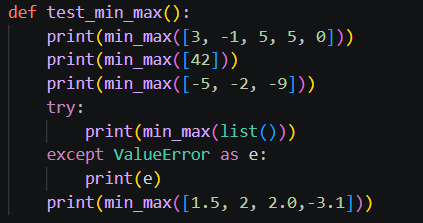
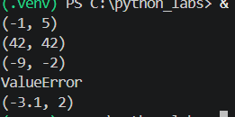
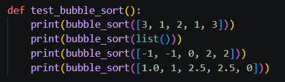
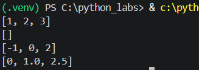
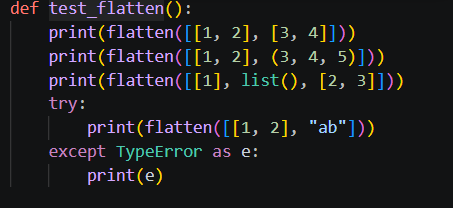
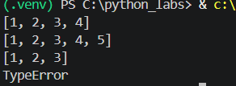
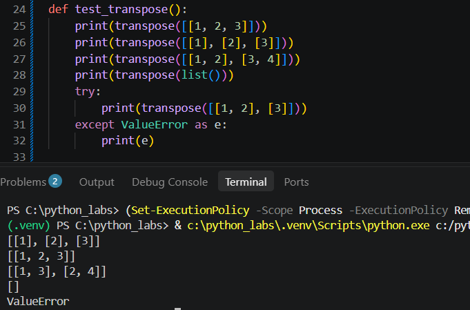
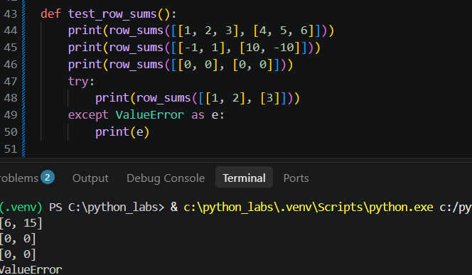
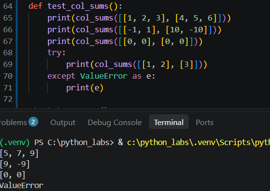
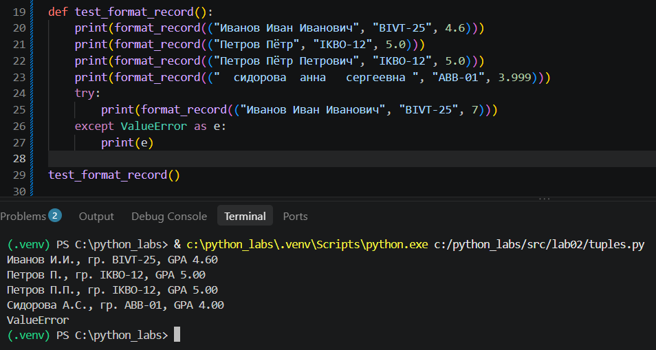

## ЛР2 — Коллекции и матрицы (list/tuple/set/dict)

### Задание 1

#### Поиск минимума и максимума

#### Сортировка (с неповторяющимися элементами)

#### Слияние в один список

### Задание 2

#### Транспонирование матрицы

#### Сумма элементов в каждом строке

#### Сумма элементов в каждом столбце

### Задание 3

